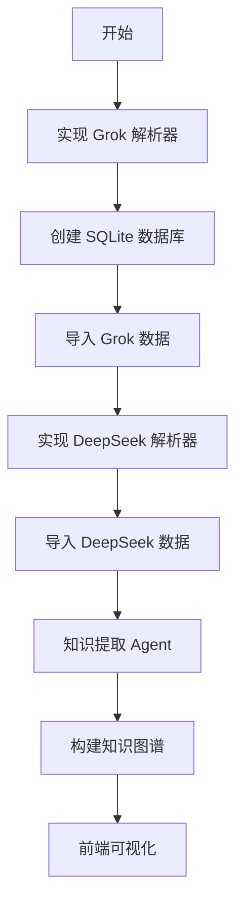

# 大模型平台数据导出对比分析报告

> 分析日期：2026-06-16
> 分析对象：Grok (xAI) vs DeepSeek
> 目的：评估各平台数据导出能力，为统一数据管理系统设计提供依据

---

## 一、平台基本信息

| 维度 | Grok (xAI) | DeepSeek |
|------|------------|----------|
| **开发商** | xAI (Elon Musk) | 深度求索 (中国) |
| **主模型** | Grok-3, Grok-3.5 | DeepSeek-V3, DeepSeek-R1 |
| **主要市场** | 全球（通过 X/Twitter） | 中国为主，全球可用 |
| **数据导出** | ✅ 官方支持 | ⚠️ 无官方导出 |
| **导出方式** | Settings → Data Export | 需手动抓包或脚本 |

---

## 二、Grok 数据格式详细分析

### 2.1 导出文件结构

```
export_data_grok/
└── {user_id}/
    ├── prod-grok-backend.json        ← 核心对话数据
    ├── prod-mc-auth-mgmt-api.json    ← 用户信息、登录会话
    ├── prod-mc-billing.json          ← 订阅信息
    └── prod-mc-asset-server/         ← 附件资源
```

### 2.2 对话数据结构

```json
{
  "conversations": [
    {
      "conversation": {
        "id": "uuid",
        "user_id": "uuid",
        "create_time": "2026-06-16T01:30:51.533788Z",
        "modify_time": "2026-06-16T01:31:16.699241Z",
        "title": "对话标题",
        "summary": "",
        "starred": false,
        "system_prompt_name": "",
        "media_types": [],
        "temporary": false
      },
      "responses": [
        {
          "response": {
            "_id": "uuid",
            "conversation_id": "uuid",
            "message": "消息内容（Markdown）",
            "sender": "human | assistant",
            "create_time": {
              "$date": { "$numberLong": "1781573451575" }
            },
            "metadata": {},
            "model": "grok-3"
          }
        }
      ]
    }
  ]
}
```

### 2.3 Grok 独特特性

#### 📌 特性 1：MongoDB 风格时间戳
```json
"create_time": {
  "$date": {
    "$numberLong": "1781573451575"  // 毫秒级 Unix 时间戳
  }
}
```
**处理方式**：
```typescript
function parseGrokTimestamp(ts: any): string {
  if (ts?.$date?.$numberLong) {
    return new Date(parseInt(ts.$date.$numberLong)).toISOString();
  }
  return new Date(ts).toISOString();
}
```

#### 📌 特性 2：引用卡片系统
Grok 使用自定义 XML 标签表示引用：
```html
<grok:render card_id="6a0785" card_type="citation_card" type="render_inline_citation">
  <argument name="citation_id">31</argument>
</grok:render>
```

**处理方式**：
```typescript
function extractGrokCitations(content: string): Citation[] {
  const regex = /<grok:render[^>]*card_type="citation_card"[^>]*>[\s\S]*?<argument name="citation_id">(\d+)<\/argument>[\s\S]*?<\/grok:render>/g;
  const citations: Citation[] = [];
  let match;
  while ((match = regex.exec(content)) !== null) {
    citations.push({ id: match[1] });
  }
  return citations;
}

function cleanGrokContent(content: string): string {
  return content.replace(/<grok:render[^>]*>[\s\S]*?<\/grok:render>/g, '').trim();
}
```

#### 📌 特性 3：用户信息丰富
```json
{
  "user": {
    "userId": "uuid",
    "email": "user@gmail.com",
    "givenName": "michel",
    "familyName": "yeer",
    "profileImage": "users/.../profile-picture.webp",
    "birthDate": "1996-01-01T00:00:00+00:00",
    "sessionTierId": "2",  // 订阅等级
    "allowNsfwContent": true
  },
  "sessions": [
    {
      "sessionId": "uuid",
      "createTime": "2026-01-27T12:26:10Z",
      "userAgent": "Mozilla/5.0 ...",
      "cfMetadata": {
        "ipAddress": "45.140.88.146",
        "city": "Los Angeles",
        "country": "US",
        "timezone": "America/Los_Anangeles"
      }
    }
  ]
}
```

#### 📌 特性 4：会话元数据
- **temporary**: 是否为临时对话
- **media_types**: 支持的媒体类型
- **system_prompt_name**: 使用的系统提示词名称
- **controller**: 控制器类型
- **task_result_id**: 任务结果 ID（用于异步任务）

### 2.4 Grok 数据统计（实际导出）

| 指标 | 数值 |
|------|------|
| 对话总数 | 93 |
| 消息总数 | 1,071 |
| 用户消息 | 532 |
| 助手回复 | 539 |
| 平均每对话消息数 | 11.5 |
| 最长对话消息数 | 44+ |
| 时间跨度 | 2026-01 至 2026-06 |

---

## 三、DeepSeek 数据格式详细分析

### 3.1 导出方式

DeepSeek **无官方导出功能**，需通过以下方式获取：

| 方式 | 难度 | 推荐度 |
|------|------|--------|
| 浏览器开发者工具抓包 | 中 | ⭐⭐⭐ |
| 油猴脚本 | 低 | ⭐⭐⭐ |
| API 自行记录 | 低 | ⭐⭐⭐⭐ |
| 手动复制 | 低 | ⭐⭐ |

### 3.2 对话数据结构（抓包获取）

```json
{
  "id": "uuid",
  "title": "对话标题",
  "inserted_at": "2025-04-01T03:30:45+08:00",
  "updated_at": "2025-04-01T04:05:50+08:00",
  "mapping": {
    "1": {
      "message": {
        "model": "deepseek-reasoner",
        "fragments": [
          { "type": "REQUEST", "content": "用户的问题" }
        ]
      }
    },
    "2": {
      "message": {
        "model": "deepseek-reasoner",
        "fragments": [
          { "type": "SEARCH", "results": [...] },
          { "type": "THINK", "content": "推理过程" },
          { "type": "RESPONSE", "content": "AI的回答（Markdown）" }
        ]
      }
    }
  }
}
```

### 3.3 DeepSeek 独特特性

#### 📌 特性 1：Fragment 分段结构
DeepSeek 将助手回复拆分为多个 fragment：

| Fragment 类型 | 说明 | 特点 |
|--------------|------|------|
| `REQUEST` | 用户提问 | 单独一个 fragment |
| `RESPONSE` | AI 最终回答 | Markdown 格式 |
| `SEARCH` | 搜索结果 | 包含 URL 和摘要 |
| `THINK` | 推理过程 | DeepSeek-R1 特有 |

**处理方式**：
```typescript
interface DeepSeekFragment {
  type: 'REQUEST' | 'RESPONSE' | 'SEARCH' | 'THINK';
  content?: string;
  results?: SearchResult[];
}

function extractDeepSeekContent(fragments: DeepSeekFragment[]): {
  question: string;
  answer: string;
  thinking: string;
  sources: SearchResult[];
} {
  const question = fragments.find(f => f.type === 'REQUEST')?.content || '';
  const answer = fragments.find(f => f.type === 'RESPONSE')?.content || '';
  const thinking = fragments.find(f => f.type === 'THINK')?.content || '';
  const sources = fragments.find(f => f.type === 'SEARCH')?.results || [];

  return { question, answer, thinking, sources };
}
```

#### 📌 特性 2：推理过程透明
DeepSeek-R1 会展示完整推理链：
```json
{
  "type": "THINK",
  "content": "让我分析这个问题...\n首先...\n其次...\n因此..."
}
```

**优势**：
- 可以学习 AI 的思考方式
- 便于调试和理解 AI 决策
- 推理过程本身也是知识

#### 📌 特性 3：搜索来源标注
```json
{
  "type": "SEARCH",
  "results": [
    {
      "url": "https://example.com/article",
      "title": "文章标题",
      "snippet": "相关摘要..."
    }
  ]
}
```

#### 📌 特性 4：模型标识清晰
```json
{
  "model": "deepseek-reasoner"  // 或 "deepseek-chat"
}
```

| 模型标识 | 说明 |
|----------|------|
| `deepseek-chat` | DeepSeek-V3 通用对话 |
| `deepseek-reasoner` | DeepSeek-R1 推理模型 |

### 3.4 DeepSeek 数据结构问题

| 问题 | 说明 | 影响 |
|------|------|------|
| **无官方导出** | 需手动抓包，数据不完整 | ⚠️ 高 |
| **格式不稳定** | API 结构可能随时变化 | ⚠️ 中 |
| **时间格式不统一** | ISO8601 带时区 | ℹ️ 低 |
| **无用户信息** | 抓包数据不含用户资料 | ℹ️ 低 |
| **消息 ID 不明确** | mapping key 是序号非 UUID | ⚠️ 中 |

---

## 四、功能对比矩阵

### 4.1 数据导出能力

| 功能 | Grok | DeepSeek | 说明 |
|------|------|----------|------|
| **官方导出** | ✅ | ❌ | Grok 有 Settings → Export |
| **导出格式** | JSON | 需抓包 | Grok 更规范 |
| **完整性** | ✅ 完整 | ⚠️ 部分 | DeepSeek 可能遗漏 |
| **用户信息** | ✅ | ❌ | Grok 包含完整用户资料 |
| **会话历史** | ✅ | ⚠️ | DeepSeek 需手动加载 |
| **附件导出** | ✅ | ❌ | Grok 有 asset-server |

### 4.2 数据结构特性

| 特性 | Grok | DeepSeek | 优势方 |
|------|------|----------|--------|
| **时间格式** | MongoDB `$date` | ISO8601 | DeepSeek（更标准） |
| **消息组织** | responses 数组 | mapping 对象 | Grok（更清晰） |
| **消息 ID** | UUID | 序号 | Grok（更规范） |
| **模型标识** | `grok-3` | `deepseek-reasoner` | 平手 |
| **引用系统** | 自定义 XML 标签 | 无 | Grok |
| **推理过程** | 无 | ✅ THINK fragment | DeepSeek |
| **搜索来源** | 引用卡片 | SEARCH fragment | 各有特色 |

### 4.3 内容处理能力

| 能力 | Grok | DeepSeek | 说明 |
|------|------|----------|------|
| **Markdown 支持** | ✅ | ✅ | 都支持 |
| **代码高亮** | ✅ | ✅ | 都支持 |
| **图片生成** | ✅ (Flux) | ❌ | Grok 有图像生成 |
| **实时搜索** | ✅ | ✅ | 都支持联网搜索 |
| **推理展示** | ❌ | ✅ | DeepSeek 展示思考过程 |
| **多模态** | ✅ | ⚠️ | Grok 支持更多媒体类型 |

### 4.4 知识提取价值

| 维度 | Grok | DeepSeek | 说明 |
|------|------|----------|------|
| **对话质量** | ⭐⭐⭐⭐ | ⭐⭐⭐⭐⭐ | DeepSeek-R1 推理更深 |
| **来源可追溯** | ⭐⭐⭐⭐ | ⭐⭐⭐⭐⭐ | 都有引用/搜索 |
| **知识密度** | ⭐⭐⭐ | ⭐⭐⭐⭐ | DeepSeek 推理包含更多知识 |
| **结构化程度** | ⭐⭐⭐⭐ | ⭐⭐⭐ | Grok 格式更规范 |
| **提取难度** | ⭐⭐⭐ | ⭐⭐⭐⭐ | DeepSeek fragment 需额外处理 |

---

## 五、统一数据模型设计

### 5.1 设计原则

1. **取两者之长**：结合 Grok 的规范结构和 DeepSeek 的丰富内容
2. **向前兼容**：支持未来新增平台（ChatGPT、Claude 等）
3. **知识友好**：便于后续知识提取和图谱构建

### 5.2 统一消息模型

```typescript
interface UnifiedMessage {
  // === 基础标识 ===
  id: string;                      // 统一 UUID
  conversation_id: string;
  source: 'grok' | 'deepseek' | 'chatgpt' | 'claude';
  source_message_id: string;       // 原平台消息 ID

  // === 内容 ===
  role: 'user' | 'assistant' | 'system';
  content: string;                 // 最终呈现内容（Markdown）
  raw_content?: string;            // 原始内容（含特殊标签）

  // === 时间 ===
  timestamp: string;               // ISO8601 统一格式
  source_timestamp?: any;          // 原始时间格式

  // === 模型信息 ===
  model?: string;                  // "grok-3" | "deepseek-reasoner"
  model_family?: string;           // "grok" | "deepseek" | "gpt" | "claude"

  // === DeepSeek 特有 ===
  thinking_process?: string;       // THINK fragment 内容
  search_sources?: SearchResult[]; // SEARCH fragment 结果

  // === Grok 特有 ===
  citations?: Citation[];          // 引用卡片
  grok_renders?: GrokRender[];     // 原始渲染标签

  // === 通用元数据 ===
  metadata: {
    tokens?: number;
    processing_time_ms?: number;
    content_type: 'text' | 'code' | 'image' | 'mixed';
    has_thinking?: boolean;        // 是否包含推理过程
    has_search?: boolean;          // 是否包含搜索结果
    has_citations?: boolean;       // 是否包含引用
  };
}
```

### 5.3 统一对话模型

```typescript
interface UnifiedConversation {
  // === 基础标识 ===
  id: string;
  source: 'grok' | 'deepseek' | 'chatgpt' | 'claude';
  source_conversation_id: string;

  // === 内容 ===
  title: string;
  summary?: string;
  tags: string[];

  // === 时间 ===
  created_at: string;              // ISO8601
  updated_at: string;
  first_message_at?: string;
  last_message_at?: string;

  // === 统计 ===
  message_count: number;
  user_message_count: number;
  assistant_message_count: number;
  thinking_message_count: number;  // DeepSeek 推理消息数
  total_tokens?: number;

  // === 平台特有 ===
  platform_metadata: {
    // Grok 特有
    grok?: {
      starred: boolean;
      temporary: boolean;
      system_prompt_name?: string;
      media_types?: string[];
    };
    // DeepSeek 特有
    deepseek?: {
      model_type: 'chat' | 'reasoner';
      has_search: boolean;
      has_thinking: boolean;
    };
  };

  // === 知识提取状态 ===
  knowledge_extraction: {
    status: 'pending' | 'processing' | 'completed' | 'failed';
    extracted_at?: string;
    node_count: number;
    edge_count: number;
    confidence: number;
  };
}
```

### 5.4 平台转换器接口

```typescript
interface PlatformConverter {
  source: string;

  // 解析原始数据
  parse(rawData: any): ParsedData;

  // 转换对话
  convertConversation(parsed: ParsedData): UnifiedConversation;

  // 转换消息
  convertMessage(rawMessage: any, conversationId: string): UnifiedMessage;

  // 清洗内容
  cleanContent(rawContent: string): string;

  // 提取特殊内容
  extractMetadata(rawMessage: any): MessageMetadata;
}

// Grok 转换器
class GrokConverter implements PlatformConverter {
  source = 'grok';

  parse(rawData: any) {
    return {
      conversations: rawData.conversations,
      user: rawData.user
    };
  }

  cleanContent(rawContent: string): string {
    // 移除 <grok:render> 标签
    return rawContent
      .replace(/<grok:render[^>]*>[\s\S]*?<\/grok:render>/g, '')
      .trim();
  }

  extractMetadata(rawMessage: any) {
    return {
      has_citations: rawMessage.message.includes('grok:render'),
      content_type: this.detectContentType(rawMessage.message)
    };
  }
}

// DeepSeek 转换器
class DeepSeekConverter implements PlatformConverter {
  source = 'deepseek';

  parse(rawData: any) {
    return {
      conversations: Array.isArray(rawData) ? rawData : [rawData]
    };
  }

  convertMessage(rawMessage: any, conversationId: string): UnifiedMessage {
    const fragments = rawMessage.fragments || [];
    const { question, answer, thinking, sources } =
      this.extractFromFragments(fragments);

    return {
      id: generateUUID(),
      conversation_id: conversationId,
      source: 'deepseek',
      source_message_id: rawMessage.id || generateUUID(),
      role: fragments[0]?.type === 'REQUEST' ? 'user' : 'assistant',
      content: question || answer,
      thinking_process: thinking,
      search_sources: sources,
      timestamp: rawMessage.inserted_at || new Date().toISOString(),
      model: rawMessage.model,
      model_family: 'deepseek',
      metadata: {
        has_thinking: !!thinking,
        has_search: sources.length > 0,
        content_type: 'text'
      }
    };
  }
}
```

---

## 六、数据质量评估

### 6.1 Grok 数据质量

| 维度 | 评分 | 说明 |
|------|------|------|
| **完整性** | ⭐⭐⭐⭐⭐ | 官方导出，数据完整 |
| **一致性** | ⭐⭐⭐⭐ | 格式统一，偶有空值 |
| **可用性** | ⭐⭐⭐⭐ | 需处理特殊格式 |
| **时效性** | ⭐⭐⭐⭐⭐ | 实时导出 |
| **安全性** | ⭐⭐⭐⭐ | 包含敏感信息需脱敏 |

**数据问题**：
1. 部分对话 `summary` 为空
2. 引用卡片需特殊处理
3. MongoDB 时间戳需转换
4. 包含用户 IP 等敏感信息

### 6.2 DeepSeek 数据质量

| 维度 | 评分 | 说明 |
|------|------|------|
| **完整性** | ⭐⭐⭐ | 需手动抓包，可能遗漏 |
| **一致性** | ⭐⭐⭐ | 格式可能变化 |
| **可用性** | ⭐⭐⭐⭐ | Fragment 结构清晰 |
| **时效性** | ⭐⭐⭐ | 需手动操作 |
| **安全性** | ⭐⭐⭐⭐⭐ | 不含用户信息 |

**数据优势**：
1. 推理过程完整记录
2. 搜索来源明确标注
3. 模型类型标识清晰

---

## 七、知识提取价值分析

### 7.1 Grok 知识提取策略

```typescript
// Grok 知识提取重点
const grokKnowledgeStrategy = {
  // 1. 引用内容提取
  extractCitations: (content: string) => {
    // 提取 <grok:render> 中的引用
    // 这些是 AI 参考的来源，可信度高
  },

  // 2. 对话主题分析
  analyzeTopic: (conversation: UnifiedConversation) => {
    // 从 title 和前几条消息提取主题
  },

  // 3. 图像生成记录
  extractImagePrompts: (messages: UnifiedMessage[]) => {
    // 如果支持 Flux，提取图像生成提示词
  }
};
```

### 7.2 DeepSeek 知识提取策略

```typescript
// DeepSeek 知识提取重点
const deepseekKnowledgeStrategy = {
  // 1. 推理链提取（核心价值）
  extractReasoningChain: (thinking: string) => {
    // 提取 THINK fragment 中的推理步骤
    // 这是 DeepSeek 最有价值的部分
    return {
      steps: thinking.split('\n').filter(line => line.trim()),
      conclusion: extractConclusion(thinking),
      confidence: assessConfidence(thinking)
    };
  },

  // 2. 搜索来源提取
  extractSources: (sources: SearchResult[]) => {
    // 提取 SEARCH fragment 中的来源
    // 用于验证和补充知识
    return sources.map(s => ({
      url: s.url,
      title: s.title,
      credibility: assessCredibility(s.url)
    }));
  },

  // 3. 知识点从推理过程提取
  extractKnowledgeFromThinking: (thinking: string) => {
    // 推理过程中包含大量隐式知识
    // "首先...其次...因此..." 结构
  }
};
```

### 7.3 综合知识提取策略

```typescript
// 综合两个平台的知识提取
const combinedStrategy = {
  // 提取显式知识（直接回答）
  extractExplicitKnowledge: (message: UnifiedMessage) => {
    return {
      content: message.content,
      type: 'explicit',
      confidence: 0.9,
      source: message.source
    };
  },

  // 提取隐式知识（推理过程）
  extractImplicitKnowledge: (message: UnifiedMessage) => {
    if (message.source === 'deepseek' && message.thinking_process) {
      return {
        content: message.thinking_process,
        type: 'implicit',
        confidence: 0.7,
        source: 'reasoning_chain'
      };
    }
    return null;
  },

  // 提取来源知识（引用/搜索）
  extractSourceKnowledge: (message: UnifiedMessage) => {
    const sources = message.search_sources || message.citations || [];
    return sources.map(s => ({
      content: s.snippet || s.title,
      type: 'reference',
      url: s.url,
      confidence: 0.8
    }));
  }
};
```

---

## 八、实现优先级建议

### 8.1 Phase 1: 基础导入（1-2天）

| 任务 | 优先级 | 说明 |
|------|--------|------|
| Grok 解析器 | P0 | 已有数据，格式明确 |
| 统一数据模型 | P0 | 核心基础设施 |
| SQLite 存储 | P0 | 本地持久化 |
| 基础导入脚本 | P0 | 批量导入 |

### 8.2 Phase 2: DeepSeek 支持（2-3天）

| 任务 | 优先级 | 说明 |
|------|--------|------|
| DeepSeek 解析器 | P1 | Fragment 处理 |
| 推理过程提取 | P1 | 核心价值 |
| 搜索来源处理 | P2 | 补充知识 |

### 8.3 Phase 3: 知识提取（3-5天）

| 任务 | 优先级 | 说明 |
|------|--------|------|
| 知识提取 Prompt | P0 | 设计提取规则 |
| Grok 引用提取 | P1 | 来源追溯 |
| DeepSeek 推理提取 | P1 | 隐式知识 |
| 知识图谱构建 | P1 | 关系建立 |

---

## 九、总结与建议

### 9.1 平台选择建议

| 场景 | 推荐平台 | 原因 |
|------|----------|------|
| **日常问答** | 两者皆可 | 都能满足 |
| **深度推理** | DeepSeek | 推理过程透明 |
| **实时信息** | Grok | X/Twitter 数据 |
| **知识提取** | DeepSeek | 推理链是金矿 |
| **数据管理** | Grok | 官方导出规范 |

### 9.2 数据管理建议

1. **统一存储**：两个平台数据导入同一数据库
2. **差异化处理**：
   - Grok：重点提取引用来源
   - DeepSeek：重点提取推理过程
3. **知识融合**：相同主题跨平台合并
4. **定期备份**：Grok 定期导出，DeepSeek 定期抓包

### 9.3 下一步行动



---

## 附录：技术细节

### A. 时间格式转换函数

```typescript
// 统一时间格式处理
function normalizeTimestamp(timestamp: any, source: string): string {
  switch (source) {
    case 'grok':
      // MongoDB 风格: { "$date": { "$numberLong": "..." } }
      if (timestamp?.$date?.$numberLong) {
        return new Date(parseInt(timestamp.$date.$numberLong)).toISOString();
      }
      return new Date(timestamp).toISOString();

    case 'deepseek':
      // ISO8601: "2025-04-01T03:30:45+08:00"
      return new Date(timestamp).toISOString();

    default:
      return new Date(timestamp).toISOString();
  }
}
```

### B. 内容清洗函数

```typescript
// 统一内容清洗
function cleanContent(rawContent: string, source: string): string {
  let cleaned = rawContent;

  // 移除平台特定标签
  switch (source) {
    case 'grok':
      cleaned = cleaned.replace(/<grok:render[^>]*>[\s\S]*?<\/grok:render>/g, '');
      break;
    case 'deepseek':
      // DeepSeek 内容相对干净，主要是 Markdown
      break;
  }

  // 通用清洗
  cleaned = cleaned
    .replace(/\n{3,}/g, '\n\n')  // 压缩多余空行
    .trim();

  return cleaned;
}
```

### C. 数据验证 Schema

```typescript
// Zod Schema 验证
import { z } from 'zod';

const UnifiedMessageSchema = z.object({
  id: z.string().uuid(),
  conversation_id: z.string().uuid(),
  source: z.enum(['grok', 'deepseek', 'chatgpt', 'claude']),
  source_message_id: z.string(),
  role: z.enum(['user', 'assistant', 'system']),
  content: z.string().min(1),
  timestamp: z.string().datetime(),
  model: z.string().optional(),
  thinking_process: z.string().optional(),
  search_sources: z.array(z.object({
    url: z.string().url(),
    title: z.string(),
    snippet: z.string().optional()
  })).optional(),
  metadata: z.object({
    content_type: z.enum(['text', 'code', 'image', 'mixed']),
    has_thinking: z.boolean().optional(),
    has_search: z.boolean().optional(),
    has_citations: z.boolean().optional()
  })
});

// 验证函数
function validateMessage(data: unknown): UnifiedMessage {
  return UnifiedMessageSchema.parse(data);
}
```
